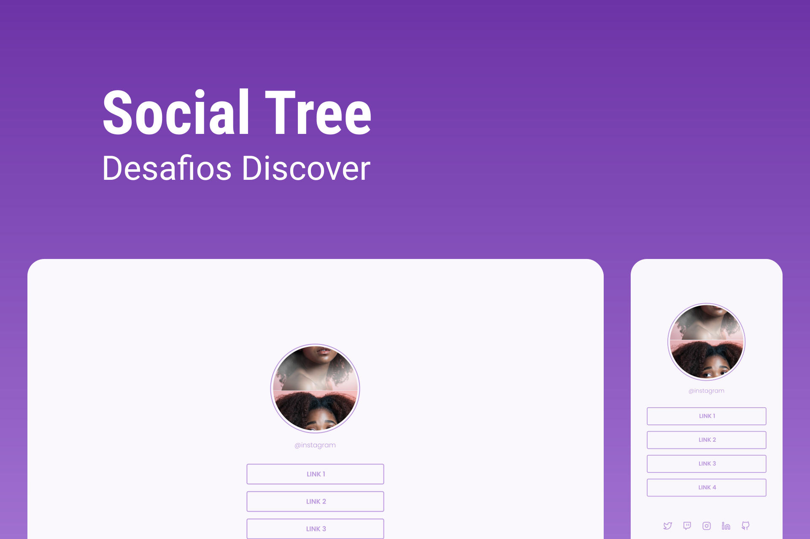

<h1 align="center">Link Tree</h1>

Página de links clean

 

<a href="https://www.figma.com/file/vuiQ5TxPsPrzXJvo5nzzmk/DD-%2F-Social-links-(Copy)?node-id=120%3A19">Layout do projeto</a>

Tecnologias utilizadas:
 HTML e CSS
 Git e GitHub

